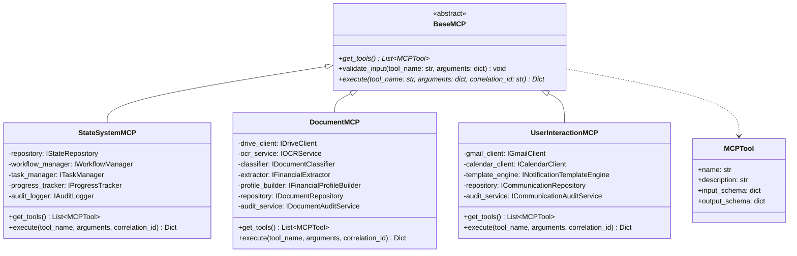
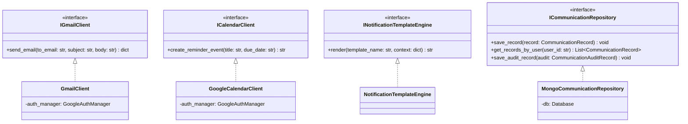
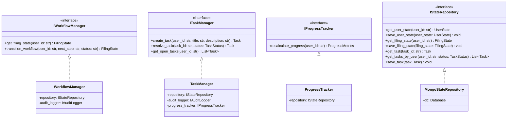

# Class Diagrams - MCP Layer

This document contains Mermaid diagrams visualizing the class hierarchies, interface contracts, and relationships between components in the Model Context Protocol (MCP) layer.

---

## 1. Common MCP Framework Base

All MCP controllers inherit from `BaseMCP`, using `MCPTool` definitions to declare metadata.

---

## 2. Document MCP Architecture

Visualizes interfaces, adapters, repositories, and domain models.

```mermaid
classDiagram
    class IDriveClient {
        <<interface>>
        +download_file(file_id: str) bytes
        +get_file_metadata(file_id: str) dict
    }
    class GoogleDriveClient {
        -auth_manager: GoogleAuthManager
    }
    IDriveClient <|.. GoogleDriveClient

    class IOCRService {
        <<interface>>
        +extract_text(document_bytes: bytes, mime_type: str) str
    }
    class GeminiOCRService
    IOCRService <|.. GeminiOCRService

    class IDocumentClassifier {
        <<interface>>
        +classify_text(text: str) ClassificationResult
    }
    class FinancialDocumentClassifier
    IDocumentClassifier <|.. FinancialDocumentClassifier

    class IFinancialExtractor {
        <<interface>>
        +extract_fields(text: str, document_type: str) FinancialData
    }
    class FinancialExtractor
    IFinancialExtractor <|.. FinancialExtractor

    class IFinancialProfileBuilder {
        <<interface>>
        +update_profile(user_id: str, data: FinancialData) FinancialProfile
    }
    class FinancialProfileBuilder {
        -repository: IDocumentRepository
    }
    IFinancialProfileBuilder <|.. FinancialProfileBuilder

    class IDocumentRepository {
        <<interface>>
        +get_document(document_id: str) ProcessedDocument
        +get_documents_by_user(user_id: str) List~ProcessedDocument~
        +save_document(document: ProcessedDocument) void
        +get_financial_profile(user_id: str) FinancialProfile
        +save_financial_profile(profile: FinancialProfile) void
    }
    class MongoDocumentRepository {
        -db: Database
    }
    IDocumentRepository <|.. MongoDocumentRepository

    class IDocumentAuditService {
        <<interface>>
        +log_audit(document_id: str, action: str, details: dict) DocumentAuditRecord
        +get_audit_records(document_id: str) List~DocumentAuditRecord~
    }
    class DocumentAuditService {
        -repository: IDocumentRepository
    }
    IDocumentAuditService <|.. DocumentAuditService
```

---

## 3. User Interaction MCP Architecture

Visualizes components, notifications, calendar setups, and templates.

---

## 4. State/System MCP Architecture

Visualizes task trackers, state configurations, and audit logging.

