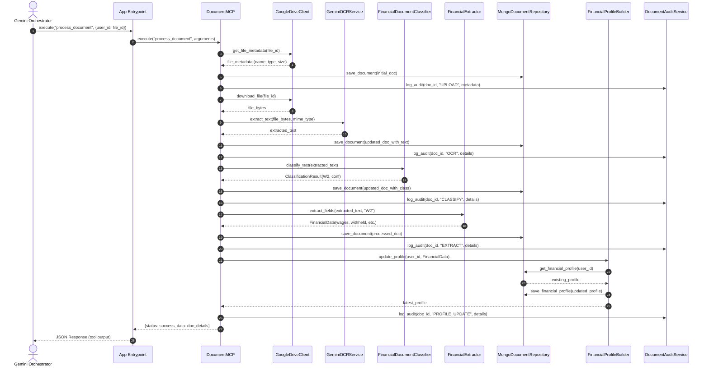
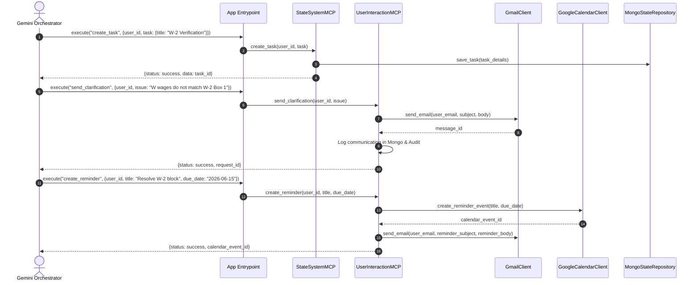

# Sequence Diagrams - MCP Layer

This document contains Mermaid sequence diagrams illustrating the communication flow between the replacing orchestrator (e.g. Gemini), the MCP controllers, internal domain services, and adapters.

---

## 1. Document Ingestion Pipeline Flow (`process_document`)

This diagram tracks the execution flow initiated by calling the `process_document` tool.

---

## 2. Interactive Clarification and Reminder Scheduling

This diagram shows how the orchestrator manages filing blockers by invoking the User Interaction and State MCPs.

